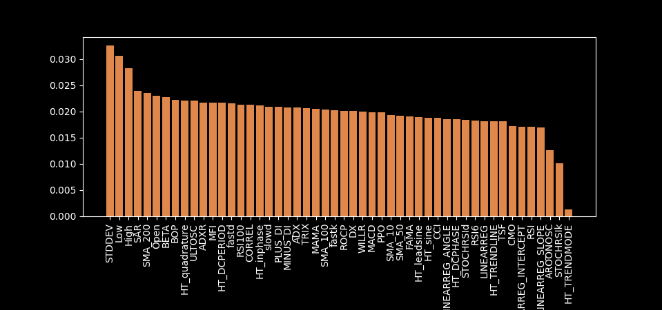

### Stock price prediction using Random Forest classification!

<br>


## About the project
This project aims to predict the price movements of stock equities using machine learning applied to technical indicators.
The project is intended to study and inform, rather than generate profits.
Random Forests generate data about the importance of the features supplied to the model.
The use of binary classification for targets allows for easy interpretation of the results through a confusion matrix.
This allows for informed iterative refinement of the model.

<b>The workflow is as follows:</b>
1. Data Preprocessing
   * Get historical price **data** for the SP500 using yfinance.
   * Add **features**: TA-Lib technical indicators
   * Add the **target**: tomorrow's price movement (up/dn) and volatility (hi/lo)
   * **Split** the data into training and testing (80% oldest / 20% newest)
   * **Scale** the training data using sklearn and apply the same scale to the testing data
2. Machine Learning (the easy part)
   * Use Random Forest classifier to **fit the model** to the training data.
   * RF is slow, but can be sped up through multiprocessing with `n_jobs`
3. Evaluate the model 
   * Use a confusion matrix and calculate **accuracy**, precision, recall, and F1
   * Extract and plot the **importance** of features.

<b>Some of the takeaways are:</b>
* The strengths and limitations of RF and ML for price prediction
* Trends in the parameters of useful technical indicators
* The utility of specific technical indicators in price prediction

## Pipeline Usage
Inputs
* SP500 symbols can be subset and time periods can be adjusted in `get_stock_data`.
* Any other dataset with the same structure as yfinance is also acceptable.

Feature Engineering
* TA Lib transformations are defined in `rf_functions.py` and can be customized there.
  * The current list was selected to have minimal correlation between indicators.
* All values are scaled for stationarity between equities:
  * A subsample of about 50 equities or more is needed to distinguish correlation with price.
  * Values highly correlated with price (ex: moving averages) become the percent difference.
  * Moderate correlations with price (ex: stdev) are simply divided be the close price.
  * All values are secondly autoscaled using the standard scaler.


Target Definition
* Data split can be adjusted in `split_data_timeseries`. Default is 80% training, 20% valiation.
* Use either `target_up_dn` or `target_zscore` to change the boolean target.
* RF is very sensitive to imbalance. Adjusting the zscore threshold ensures balanced classes.
* Yes, weighting would be another way to handle this, but slightly complicates interpretation.


## Results

For volatility prediction, the model performs fairly well when `threshold=0.4` with balanced classes.
```commandline
Predicted  0.0  1.0
Actual             
0.0        813  773
1.0        551  913
Accuracy: 0.5659016393442623
Precision: 0.5415183867141162
Recall: 0.6236338797814208
F1 score: 0.5796825396825396
```
Unsurprisingly, STDEV and the previous range are important for predicting volatility.



Predicting price movement (up/down) is a difficult task. The model typically exceeds 50% accuracy!

```commandline
Predicted  0.0   1.0
Actual              
0.0        478   957
1.0        472  1082
Accuracy: 0.5219136835061894
Precision: 0.5306522805296714
Recall: 0.6962676962676962
F1 score: 0.6022822154188701
```

So what features are predictive of direction? Not RSI. What is this HT_quadrature? What is BETA?


# Future directions
_Quick trip to the library..._


